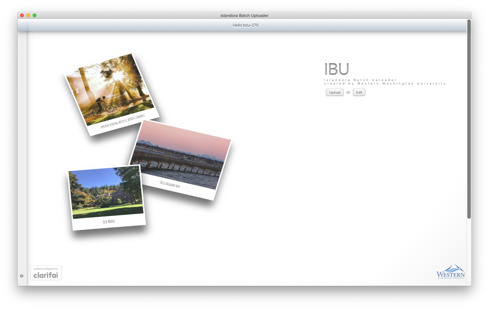

# IBU User Documentation v1.8

Notes:
- Updated 01 June 2020
- Some of these steps are for WWU users only.  Documentation for non-WWU users is coming soon.
- For more technical documentation, please see https://bitbucket.org/wwulibraries/islandora-batch-uploader

Installation / Setup

- [ ] Download from https://mabel.wwu.edu/ibu
- [ ] Connect to VPN (remotevpn.wwu.edu or securevpn.wwu.edu)
- [ ] Double-click the setup file
- [ ] If you encounter a warning/error screen:
    - macOS
        - [ ] if you see an "Unidentified publisher" message, cancel and right-click on the icon and click "Open".
    - Windows
        - [ ] if you see something like "Windows protected your PC".  Click "More Info" and then "Run Anyway" to proceed. 
        - 
- Configuration / setup ('gear' icon lower left corner) 
    - [ ] if @ WWU, click the "Use Default Values" button
    - [ ] add the API keys you were given
    - [ ] click on the Eye (icon) in the top-right corner to see the hidden values
    - [ ] enter your email address, username and password and try to login
        - if you encounter a problem, close IBU and make sure you're connected to the VPN (if you are off-campus, using WiFi, or using IBU inside of a virtual machine) and then try again.

Uploading / Adding Files to Islandora

## Welcome (step 1 of 4)
- [ ] From the Welcome screen, click "Upload" 
- [ ] Select "Owner" 
  - Which organization on campus "owns" this file?  Who was it commissioned for?
- [ ] Choose or create "Virtual Target Collection"
  - Nerd alert: this is not a true Islandora Collection; it's a virtual collection created using Drupal Taxonomies and Views.
  - You will not be able to change the Owner or Target Collection on the next screen (Batch Description), but you can change the Target Collection on the Details screen (the last step of the process).
  - If you are creating a new Virtual Target Collection, you will be prompted to choose a thumbnail on the next screen.
- [ ] Access (Public or Restricted)
    - Please choose Public whenever possible.  Only Public view configurations are currently available on the Mabel website (as of 01 June 2020).
- [ ] Facial Recognition option
    - Note: if checked, IBU uses Clarifai to attempt to find faces in each photo, and will also try to suggest the name of the person in the event they've been tagged before.  All of that will be visible on the last (Details) page, but will not appear on the next screen.  
    - If you don't check this option, you can always just add a person's name as a custom tag or in the Abstract.
- [ ] Drag and drop files to begin upload process
    - 

        
Notes

        - Start with small batches, and work your way to larger batches to make sure things are working first.
        - Make sure you have the files to upload on your local device (not a remote/network drive)
        - You should hear a "finger pop" sound when all of the files have been uploaded and ingested.
        - File formats processed by MABEL
            - Tested in IBU
                - tif
                - tiff
                - jpeg
                - jpg
                - png
                - pdf 
                - mp4
                - mov
                    - note: IBU converts .mov files to .mp4 to make them web-friendly, so additional processing time will be required.
            - Not yet tested in IBU
                - gif
                - mp3
                - jp2 
                - oga
                - ogg
                - flac
                - wav
                - m4v
                - mkv
                - mpeg
                - mpe
                - mpg
                - qt
                - ogv
            - Format-specific notes:
                - Still Images
                    - Please use the highest-quality (largest resolution) version you have.  Web-friendly thumbnails will be automatically generated.  Low-resolution files will generate a warning as shown here:  
                    - Recommended format: TIF
                        - .tiff files use the large-image viewer in MABEL, which has zoom and pan, and will eventually offer other features such as a tour/exhibit feature.
                    - Tiff and JPG formats can store GPS metadata, and that will be shown the the Details page if it exists.
                    - IBU features only available to this format are indicated below by "*img"
                - Video
                    - IBU features only available to this format are indicated below by "*vid"
                - PDF
                    - IBU features only available to this format are indicated below by "*pdf"
        

## Batch Description (step 2 of 4) 
- [ ] Nothing is required in this interface, although it can save you time in the next screen if any of the values are the same for all files.
- [ ] Check the "Auto Increment" field to add consecutive numbers after each title (My Photo 1, My Photo 2, etc...).  
- [ ] Adjust the "Tag Filter" percentage to show/hide Clarifai concepts
- [ ] Adjust the "Group" slider to cluster images based on their similarity
    - if you see a yellow warning, that means that some of the thumbnails are not show.  Adjust the slider until they all appear.
- [ ] Adjust the "Zoom" slider to make the thumbnails larger or smaller
- [ ] Notice "Uploaded %" and "Ingest %".  Ideally, wait until both are at 100% before proceeding.  The overall upload and ingest progress meters are on the left toolbar.
- [ ] Occasionally an ingest error will occur. One way to discover this is that the ingest progress meter (in the left sidebar) never reaches 100%. Look through the list of files for an "ingest error - retry" notification as shown in the following screenshot: 
  - [ ] If Retry does not fix the problem, you may need to remove the file from the list by clicking on the Trash can icon.  
    - Please note: that if you remove a file from the upload list, it doesn't yet adjust the upload or ingest progress percentages, so when you go to publish, you may encounter a warning about one of those not being 100%.  In that case, just override the warning and continue with publishing.  That will be fixed in a future version.
  - TODO
    - include removed file(s) in email receipt to help user know which ones they need to try again later.

## Detail Mode (step 3 of 4)

  - [ ] required fields (indicated by a *)
      - Title
      - Release Form
      - at least one "tag" of any kind
  - [ ] Copy / Force-Copy 
      - [ ] Copy
        - [ ] Copy this value into the other files, but do not overwrite an existing values
      - [ ] Force-Copy
        - [ ] Copy this value into the other files, and overwrite any existing values
  - [ ] Release Notes
      - optional, internal (non-public) note about the permissions or release form.  You might consider adding the URL or the location of the signed release form here.
  - [ ] Title and Abstract > Suggested Captions
      - come from 3 sources:
          - the filename (stripped of some characters)
          - Microsoft AI (photos only)
          - Date Created (if defined, tries to find matches in the University calendar)
  - [ ] WWU Places
      - if you do not see any checkboxes, click the Eyecon to show more.  Click a place to confirm that the photo represents it, which will add a tag to the metadata, and also train the AI system to identify it automatically in the future.
  - [ ] People
      - if you checked the "Facial Recognition" box on the Welcome screen, you may see up to 5 faces listed here.  Choose or enter the name if you want to train it.  If you do not want to use Facial Recognition, you can always add the names to the Abstract, Title or "Add Your Own Tags".
  - [ ] GPS Coordinates (TIFF and JPG only)
    - [ ] If found in the EXIF metadata, IBU will generate a map showing where the photo was taken.  If you check the box, that metadata will be included when you publish.  
    - [ ] Click "Check All" to apply this value (checked or unchecked) to all files that have GPS data.
  - [ ] Duplicate detection (added v1.8)
      - if IBU can find a duplicate in MABEL, you will see a warning here.  To avoid duplicating the file, just click the Trash icon (lower-right corner) to remove this file from IBU.
      - It only finds "public" files
      - TODO: add a slider to adjust the sensitivity of the matching process. 
  - [ ] Notes:
      - you can click "Back", but be aware that anything you do on the previous (Batch summary) page may overwrite what you did on the Details page, so use this with caution.

## Confirmation Page (step 4 of 4)

This page confirms that publishing has finished, and if your email address and email API key are in the Settings/Configuration, you should receive an email receipt.  Please check the Junk/Spam/Clutter folder if you do not see the message within a minute or two.

  

Editing Islandora Records

From the Welcome screen, click "Edit":

- [ ] Enter IDs of records to edit
  - edit each record as you normally would
  - known issues (v1.8):
      - you cannot change the "Owner"
      - you can change the "Target Collection", but you cannot add one from this screen (yet) 
      - the copy/force copy feature has not been added to the "Target Collection" field yet.
- [ ] Publish, and if you've entered your email address and the email service API key into the Settings/Configuration, look for the email receipt (check Clutter/Junk folders)